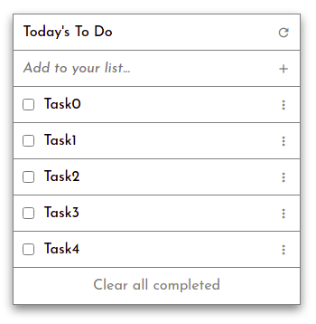

# To-do list

> Web app for a to-do list



This project is a to-do list app built using ES6 and Webpack as part of Microverse projects.

Things done so far:

### 1. Create list structure

- Use custom-built Webpack boilerplate
- Implement app structure using classes
- Populate to-do list dynamically on page load
- Implement event listener using promise
- Split JS files into modules
- Configure repository to deploy from Webpack output directory

### 2. Make list interactive

- Implement HTML Drag and Drop API on list items
- Track task status
- Implement Web Storage API for local storage of tasks
- Refactor modules using classes

### 3. Implement CRUD

- Allow user to add, edit, and delete tasks
- Make UI elements functional

## Built With

- Major languages: HTML, SCSS, JS
- Technologies used: Sass, Lighthouse, Webhint, Stylelint, ESLint, Webpack

## Live Demo

[Live Demo Link](https://AkashaRojee.github.io/to-do-list)

## Getting Started

To get a local copy up and running, follow the steps below in your terminal.

## Prerequisites

- Node.js
- npm

_For more information, <a href="https://www.akasharojee.codes/2021/06/20/intro-to-nodejs-and-npm.html" target="_blank">view the section **Installation** in this guide about Node.js and npm</a>._

## Setup

Clone the project:

```
git clone https://github.com/AkashaRojee/to-do-list.git
```

## Install

There are currently no production dependencies.

Install the development dependencies:

```
npm install
```

### Usage

The assets are in the `src` directory.

The output is in the `docs` directory.

### Deployment

**Note**: The default output directory of Webpack (`dist`) has been renamed to `docs` to facilitate publishing from GitHub Pages.

To build the website:

```
npm run build
```

To serve the website directly:

```
npm run start
```

## Author

👤 **Akasha Rojee**

- GitHub: [@AkashaRojee](https://github.com/AkashaRojee)
- Twitter: [@AkashaRojee](https://twitter.com/AkashaRojee)
- LinkedIn: [Akasha Rojee](https://linkedin.com/in/AkashaRojee)

## 🤝 Contributing

Contributions, issues, and feature requests are welcome!

Feel free to check the [issues page](../../issues/).

## Show your support

Give a ⭐️ if you like this project!

## 📝 License

This project is [MIT](./MIT.md) licensed.